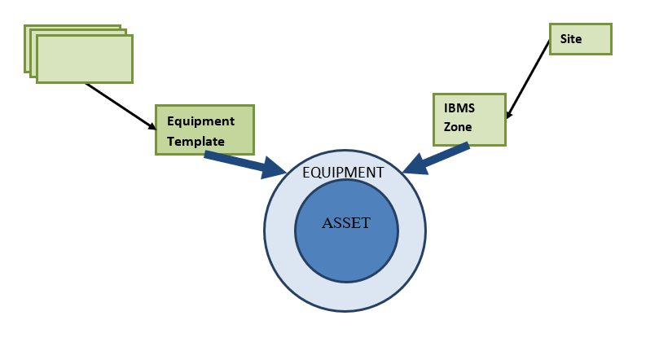

# Chapter 2: Introduction

## Application Overview

IBMS (Integrated Building Management System) Application is the managing and configuration application of underlying SCADA and other data acquisition layer which makes up the meta-data and data normalization process. IBMS layer makes iviva a SCADA (Supervisory Control And Data Acquisition) system which talks to various underlying ELV systems (HVAC, Access Control, Fire, CCTV, EVAC, Intrusion Detection, etc.) and other external systems and applications.

SCADA layer forms a major part of the core of iviva. IBMS application allows you to configure interfaces to diverse systems, add online equipment, configure points and attributes of points, configure alarms and alarm escalation levels and matrices which allow you to have a multifaceted, yet structured and manageable notification mechanism.

### IBMS Application in a Nutshell

* **IBMS** Application takes the task of **configuring** and **monitoring** of data points and **their alarms.**
* **IBMS Application** provides templates to easily input **SCADA** data in the format it recognizes.
* **Equipment** is a wrapper around an **Asset** with capabilities for **IBMS** (Points, Real-time GUI, Alarms, and Trends). Once an **Asset** is associated with an **Equipment**, you can observe an additional **IBMS** section under the details for the particular **Asset.**
* A **System** is a collection of points from different **Equipment**.
* An **Equipment Template** is a collection of **Point Templates** that forms a template for a particular make/model **Equipment**.
* A **Point Template** is a container of attributes for a point, for particular **Equipment**.
* **Alarms** and tasks related to **Alarm management** are a key part of the **IBMS Application.**
* **Alarm Viewer** displays **Alarms** in real-time while **Alarm History** would allow you to browse through the past alarms.
* An **Alarm Class** allows you to classify alarms based on **Alarm Severity**. Considering the **Alarm Severity**, you are allowed to configure **Alarm Escalation Levels** for Working Hours and After Hours.
* An **Interface** is a communication channel to a **Sub-system interface.**
* A **Trend Group** is a collection of trends for points with the same unit of measure (Group of Temperatures, Group of Pressures).

## Application Concepts

### IBMS Application at a Glance

Below illustration shows the main elements used to configure Equipment and acquiring data using the underlying Subsystem interface.

<figure><figcaption></figcaption></figure>

The above illustration depicts the dependencies, and basic components that constitute the IBMS application. Equipment builds up upon a pre-configured **Asset.**

**Equipment Template** is a collection of **Point Templates. Equipment Template** defines the points that belong to particular **Equipment.**

**IBMS Zone** is the **Site** where **Equipment** is found.

## Getting Started

The chapter contains the following:

1. How to access “**IBMS**” Application
2. Application’s Home Page
3. Dashboard Tab
4. Toolbar
5. How to Log out from the System
6. Glossary of IBMS Application Terms

### How to Access IBMS Application

To access the **IBMS** application;

1. Login to **iviva**. Your iviva home page will appear.
2. On the **Application Menu** on the left side, click the **IBMS** icon![](data:image/png;base64,iVBORw0KGgoAAAANSUhEUgAAAFAAAABFCAYAAADdCmGFAAAAAXNSR0IArs4c6QAAAARnQU1BAACxjwv8YQUAAAAJcEhZcwAADsMAAA7DAcdvqGQAAAOkSURBVHhe7ZvfbwxRFMfvX+VR4s0DacRDS5dIREJUCAkND01KkBYJyoOmJIo2oc32Adk2Qa2HXbsISZ9QkVD+i7HfkbPOTk92h7P3zmydh0/mx7l3JvPJOXdme2/d1+UX0c6t/cY/YgKVmEAlJlCJCVRiApWYQCUmUIkJVGIClZhAJSZQiQlUYgKVmEAluRJY2LEvKk4XxVgnDgweih7cmolKc4ti3Be5EQh5tWe16OfHH9HYyGWxjQTalp+U436geG9BbOeL3AjEg5OE1fefo6P7j4vtiNGT5+J21IeYunZHbO+LXAicuHhjnQhkI2+DDJ26ervlnNRv+MiZlja+yVwgMoke/uXTcsvxzORss139eT0+x8dI3pbolLndJlOBeFgqQwhCluE8L2dkFD8GGPeSfUlw8h6+yUwgZK1UVuKH/vJhtSVz4lj1d4yDdrSf7Is+KGl+jxC4zZu2iAHfoFxJBkoxGYcUigO0hyTKNELqGxJXX3snBnzCS7Jd1uCNija8vLGlTAz9xpUILhDjF8lL882GD2Ne3gDHafqGILhAKl1klRTvNTIpYXyeUEn2OpkI3Ei42tpbMWCkI2gGDmwvRIvzS94Z2DYo3t8HQTNwd9/e5hvYJ7v69oj394EJVBJ8DDxYOOwd6b6+sJeIElf7bgI1WAYqsQxUYhmoxL22DFRhJaykkYFvxICRDithJZaBSiwDlVgGKgkmkC+5wKTQ8NDpJrwdwEor6TyB/tJEE5Z+jI9cCjpdEEwg/sxE+5hYwqwapiUx64ZJdL4ii6YzpVVakIMVCbgGncO1cB3MEWO+BdcLJTEzgTwjaa6Xjkksl0RgHhnnKYZshTDe5r/IwOQqKh6HQICpTwji7ShbSSBKN8sp0swETly42RwDseKKr1AggRDFV2hBOjITWxIIsF96VFo3LobAVTMeA7EloRQngdjn4xnaQl5SIIBsGk9DrpfJTQlTZmGfC0QGQg4k0lgnCSRoTAyVjW6h/lgMdJtOArk0vg8hGONQ4lTm7QQC3t837vrDP6Xjk3YCIQlLeqUMBFSaVMpcIPoml/4iFqqM3dnJ82Kg2yQFQhhW12OLDOMPnBSIGMY/OuYCIZWuB5HY8hePb9zQ6DEx0GsgEyE25DcgcCfGTokBIx1ufPqKGDDS4e4u3RcDRjrc8qdXYsBIh6t+2xhLbbOi8VPOBGpwFctAFa5iGajCMlCJCVTSENj6f7nG32EZqMQyUEV/9As5+/Xm9QpX/gAAAABJRU5ErkJggg==). **IBMS** App’s home page will appear.

### Application’s Home Page

<table><thead><tr><th width="217">Feature on Home Page</th><th>Description</th></tr></thead><tbody><tr><td>Tabs 🡪Dashboard</td><td>Dashboard is the first tab of the Home page for IBMS application. This shows various Weblets related to the IBMS application.</td></tr><tr><td>Tabs🡪Equipment</td><td>Equipment tab shows the Equipment that has been registered in the application and provides a Search to search for the required Equipment. The same Equipment Search function is found under <strong>Settings</strong> icon. Equipment tab provides users a quick access to Equipment search.</td></tr><tr><td>Tabs🡪Systems</td><td>Systems tab shows the Systems that have been registered in the application and it provides a ‘Search’ to search for the required Systems. The same Systems Search function is found under <strong>Settings</strong>  icon. Systems tab provides users a quick access to Systems search.</td></tr><tr><td>Tabs🡪Alarms</td><td>Allows you to filter alarms using the given search criteria.</td></tr><tr><td>Tabs🡪Trends</td><td>Allows you to filter Trends according to the given search filters.</td></tr><tr><td>Tabs🡪 Trend Groups</td><td>Shows Trend Groups associated with System/Equipment or other in a Location.</td></tr><tr><td>Settings Icon </td><td>Settings icon on the Application’s Home page gives you access to settings and configuration items within the IBMS Application.</td></tr><tr><td>Global Site Filter </td><td>Global Site Filter allows to change the “Site” of the entire App at once.</td></tr></tbody></table>

Table 1 : Features on Home Page

### Dashboard Tab

Dashboard tab displays various weblets related to the **IBMS** application. On the **IBMS** Dashboard, the following default weblets can be found.

**Weblets**

* [Alarm Map](chapter-2-introduction.md#alarm-map-weblet)
* [Systems with Faculty Equipment](chapter-2-introduction.md#systems-with-faulty-equipment-weblet)
* [Alarms Confirmed by me](chapter-2-introduction.md#alarms-confirmed-by-me-weblet)
* [Alarms Assigned to me](chapter-2-introduction.md#alarms-assigned-to-me-weblet)
* [Active Alarms](chapter-2-introduction.md#active-alarms-weblet)
* [Alarm Summary](chapter-2-introduction.md#alarm-summary-weblet)
* [Monthly Alarm Summary](chapter-2-introduction.md#monthly-alarm-summary-weblet)
* [Alarm Action Summary](chapter-2-introduction.md#alarm-action-summary-weblet)
* [Faulty Equipment](chapter-2-introduction.md#faulty-equipment-weblet)
* [Overridden Points](chapter-2-introduction.md#overridden-points-weblet)


_Note –Click_ _icon on Weblets to expand the area which consists of Search criteria and Generate Report option. To collapse the expanded area with Search criteria, click the same_.png>) _icon._


#### Alarm Map Weblet

**Alarm Map** Weblet shows the Building alarms on map that are in “Alarmed’’ status for a given **Site.**

By default, the **Alarm Map** link opens Logged in user’s **Site** with alarms.

To view another Site map, select the required Site under **Site Map** box.

 **:** Alarms that are not acknowledged.

![](data:image/png;base64,iVBORw0KGgoAAAANSUhEUgAAAG0AAAASCAIAAADe7scVAAAAAXNSR0IArs4c6QAAAAlwSFlzAAAOwwAADsYBuhhcIQAAA5RJREFUWEftV89PGkEUHpv+AaLYBa+gNJQsRGJj4GBio0KzZxJjJSaczcqpiZ45eLLEMxcsMeFMqoV48EBDJRLZIJGyHLyIGxf0P7Dza9elUrNuN2lamexhefO+9958872ZZeii9Q0Mxh8zMHQhIh6vbwMGQo0ND/aA0vbCAH0DyEMGTOZROvrMZ8VHie4WsmXJ/K3oFnYOBF1h9Xv2Ddcfbi6P4te8DKqivvXoWvS/4mQqj3XxxMvFvOen9X9l+abV+dK0SAAItXO/J8S+Cu7vlSX3NENDi+nN3Al6t3LxD/NWNSG2e7lkBKR3buxMMVdFU/7l9agb+8jlre3ipQYoZD+desgsxIq+RIiFr/UDvuZMRkY0C+mXEbplzqHP+AI3pbqqKeD2g5I0R8rTDdekNE+PcnlfCi7CRVodU6AhyCQJrKlkj68nE/CZaUN+aW54ymB7xIkMV8W2B/vEg+1D4iOmtzthhIJGV2UbnX3sXLBdw4dvXQReQFQv1GRuDgeho29GMZ0BMRxtFZRyV0ptagqPmMK7+JuC+8I1OQEwjUfprAFYB9bgCMuCylmXLPjEO6No0BldoyIVsl/Aklabr31Eg2gPOohHBHQiuSHjdJicFVaLXbqBs0IN+OAGIE67kmRl7jX+a8ZFtoN2tC62F96SaMzse86G3zRG4A7FvNSoLfgxeA+NAPb1Xa/lSb9UbAveMJcgzedV+HdhFvYdcdCmuANSESpinOnMzyrNaBth7j2hM3keAIHDx2QE2dIGziiwSNKxII9WGOdH6q8AqzmeiguF8I8tKgHVmGoKNREpG//UC+8hyiQ91pvopEvw6hPzNpCC3BP+aqlAe7wrkRcmsJHgw9Lu1hHWbN+BgE1678MTo+oigmU9o5W9UpuxYNV39vd+2D2OngAQaEPxcSUrnA0D3RP2/LESrVUhfd1jhCmoUS/8gR6fJMC+zt3CYcP/LqSdYz2uVOYAXgXRBEhvJnk0Zx33Tq5G6LLZyIq0s8sLgY017RWhxnBE492tzWQKA7n4Mu1xuPhMx76EIMybSZDv0APhPrcjuoSAygUVZuDmWR3R5Sa/mUReNpef9DXQGgMc6Wto1AvvoQL+LyxCw/Vt0ACdY8MI+18MeO8dM2v4A8DQMKmvDeX+26BWOtuiNcitChhVPtSM1PWM9VhvCaCZyjQwba4Y+Ro1OiiPRuEDHGXgOfe1mSIY8GgOmz8BJtPdDpbdM+IAAAAASUVORK5CYII=) : Alarms that have been acknowledged but still in alarmed state.

How to View Alarm Details of a Selected Location

* Click on the required Building Alarm marker .png>) on map. A pop-up window will open.
*   **Equipment in Alarm:** This shows the **number of equipment in the respective Location, which has alarms at the moment**&#x20;

    e.g. **Equipment in Alarm: 3**, meaning there are 3 Equipment with one or multiple alarms&#x20;

    To view the Equipment which have alarms, click the Equipment count. It will show the Equipment with alarms on the Equipment search page.
*   **Systems in Alarm:** This shows the **number of Systems in the respective Location, which has alarms at the moment**

    e.g. **Systems in Alarm: 2**, meaning there are 2 Systems with alarms\
    To view the Systems which have alarms, click the System count. It will show the System(s) with alarms on the Systems search page.
* All the alarms in the selected Location will be categorized as per Severity-wise and their alarm count will be displayed along with the Alarm Severity color. Clicking on **Alarm Count** will open the **Alarm Viewer**.

**Child Map**

*   **View Child Map link:**

    Click on the required Building Alarm marker .png>) on map. A pop-up window will open.

    Click **View child map** link. This opens the current location’s immediate child map.\
    **Site** may consist of **Child Maps** consisting of maps of child locations/areas belong to the respective **Site**.

    To view another Child map of a Site, select the required Child map from the **Child Map** box.

**Filters in Alarm (Child) Map**

<table><thead><tr><th width="239">Filter Criteria</th><th>Description</th></tr></thead><tbody><tr><td>Alarm Severity</td><td>Used to filter by Priority of the alarm.</td></tr><tr><td>Alarm Class</td><td><strong>Alarm Class</strong> is a way to categorize alarm points into different priorities of escalation levels.</td></tr><tr><td>Site Map</td><td>Used to select the required <strong>Site</strong>.</td></tr><tr><td>Child Map</td><td>Used to select the required <strong>Child Map.</strong></td></tr><tr><td>Asset Category</td><td>Used to filter by the <strong>Asset Category</strong> that the respective <strong>Equipment</strong> belongs to.</td></tr><tr><td>System Name</td><td>Used to filter by the <strong>System</strong> that the respective <strong>Equipment</strong> belongs to.</td></tr><tr><td>Show un-acked alarms</td><td>Select to view only the alarms that are not acknowledged.</td></tr><tr><td>Show Alarm Count</td><td>Select to view the <strong>Alarm Count</strong> on the Alarm Map.</td></tr></tbody></table>


_Note –You need to upload the Location maps in_ _**Location**_ _Application beforehand, to view the maps under_ _**Alarm Map**_ _functionality._


**All Active Alarms Link**

This is used to view **all the active alarms** in the selected location.

1. Click on the required Building Alarm marker  on map. A pop-up window will open.
2. Click the **All Active Alarms** link. The current Active Alarm Count will be shown next to the link name. Active alarms will be displayed on the Alarm Viewer.

#### Systems with Faulty Equipment Weblet

This Weblet shows **Systems** with alarms (faulty **Equipment**) for a given **Site** or **All Sites.**\
\
How to View Details of Systems with Faulty Equipment

* Click the name of the required **System** shown in the Weblet. A pop-up window will open showing the name/names of the faulty equipment in the selected System.
* Click the **Real-Time GUI** link under the **System** name in the pop-up window, to open the Real-Time GUI page of the respective **System**.
  * On the Real-Time GUI page, ![](data:image/png;base64,iVBORw0KGgoAAAANSUhEUgAAAIMAAAAaCAIAAAAblni6AAAAAXNSR0IArs4c6QAAAAlwSFlzAAAOxAAADsMB2mqY3AAABH1JREFUaEPtWL9L41Ac/3rcVrSiUKpiVbIIydAuymGceiDYIUtHcYiDkx7WP+DyDzSCnRya4fC2LBkUhHPSQ/SGdmjBJdxdpVxxspXu933vJTXVahptNWAeRWx87/P98fl+P98XBxqNGgB8/fIdfwbrDTPw4Q1tB6adGQiY8Es9BEwETPglA37xI+iJgAm/ZMAvfgQ9ETDhlwz4xY+gJwIm/JIBv/jx2j0hbK6rWmY77Zf4Xf1IKRlVW19LuG586YaBLv/vhA4lY05j18fy/oF368iEHA9VD9Wsbh9Or6jLkYdIuOdSQKPNcm4vX/Bu6eGJhKRscENwz3NubUfiw9DmkuMsDbx3Pjweh6eewBjUDPkY5Xokqa2kepEf0Pcpppo5vEY8zAj7mtW5aBgfhIa5npgBKBh6sQkQmXV2ZEKYRCuVi7vK6JE1rzCemGiBm+e/H4Tk1bL7fjO/xShx39rljtJJrQEwsSAJ9gFhMTqE9JdOu0To37aPvYC2GpxA1U1tyyiR38RtbW7CRm8UDWXX9GrLoQwUrXJdjUUoJpGL80UidPilDdySILKpg9FC6arO8eHofAJKRPG4+RlEuL5EsttEsqMcMR8uMgqhjcostJSTqS4N0HHWgemagef1hLhErNIASMYlvn5hqRZw8g6tuDTc5IyW7AzFpR5M6VjoJse0McRvZNLwA/G1YvMOHCPf4G6ZvuVMiEvK5j1pM/M/UQNDk4v0OZWmRvEMB14KbjUCTj7HFcT3oL1YMXK8yaRbKwK/QSc81sRyBAmgwmvejghPi7knJnA24EUCP1js9txLT09gFRisu6lq0YoD/TRfsJtA/1MFGBx/sd5XynR0m7U6Kb2rE4LPBIeBp4QINuURUzNS/jA0I7SEyOpI6gx7TqXJwjnQDdolZB2UCFvRbu9L4mzMotP2x2a6JQK6kVWMpy84ntSJZp92HKsj0qTj2BykQtWWVQAyYwusf1nD0jUyhkm8++qQkcfuLQ7Ih782a/cvVHTChzlZyzh2D04hW22nT4+KvBzHchGH0b3KhX0xc2gs3c+icF+J0UGkNi6pmmMvBksuCJgB9tz9qumJCWpJPysvSHz881rCtGPooKqMBlsc22aG5W/BUGT3MD3vuBtUjx4lbRTnJld5x6xmNNiBPHKxdiJOjWCR4bXFWh3HQGl3jxYFCT+5I/21JmhnxzypE4OwpJZfJfOgtFuuYk9IogWfFpkaMkeZgABRsFdY1LEwt2RfUlNp26t7xplwhVujDv88Noz9VK+d0yYgKtdh/btBVYxN0wCJIrVK6lcFe+KTPQbElOWAuM1GJtCDYdKdTyzvPYFg+v4xeefiZEXEi0RWBuQch4dlZnkaUMQUI4pVxlSr3kQpxwLs+8JXE0DxzKjLlqmkAOyq074IZ06NBTjN5kbxvY8pW6OOxe7QVeuwmf9m4h4clkloVitNsMk4UFTAF0DynK25WcDX0rmJMNhSid3m8iLc7Tt235P47g08Q53efc76k4CAif7k1TtqwIT3nPXnxH8Rfgnpyp1VXAAAAABJRU5ErkJggg==) button opens the Equipment in System and their Points, Point Values, Alarm Status, etc.
  * On the Real-Time GUI page, click the ![](data:image/png;base64,iVBORw0KGgoAAAANSUhEUgAAAGAAAAAgCAIAAABiouoDAAAAAXNSR0IArs4c6QAAAAlwSFlzAAAOxAAADsIBw3GpnQAAAxtJREFUaEPtV79v2kAUPqpuCKhUCdFapVReKsEQFqSo2cgEAwtbM9GhU1Lh/AGlf0AcNZk64KldEIuHsGWjihohkQFLWSwSV24ipEaxEXvf3VkuoBLfAUoa5U4I2ef387v3vmeHXPcSiTUbgRAF6OOHbwKlKQQ+fX4LO48ELjcjIAAKqBABkABoMRIRFSQqSFTQYgiICloMP8FBooJEBS2GQIA287dYeUMtxCeNjYz9L/XuHOGtbWs5yTG1qt6bQ/u2VOb5FrNbqlLxf/Ohg1D2aQSSjEVe3laq436KNUXVNorMru+CpLt6DaP89YA5yjsUfLwM3/K73VI6Riw5AxvFJUTaJ1uqbcroRK/tmfAEji6fHBxiXMZajHSu64yisTCNBIp0p4kvMlvvKyvItpCUJI+sY6WGcG/iG2rHW8Qyvfb3iQtrYCchGN+sH2c8ryl5bLAdmD5fBUkFqE//RwuVeoXIcOtp/bBEkeJZUXSp0c5tDcDFdtlXDkvIoPsomVO11CkWO4YzyO+WMp53JR8zqfqhBZmPtU8yfL0P+7rhIKkA+2a9CjIUR5UFHRDlA2iSg8gZllehdtyTI3qevT3D5oGGyrr9nsfWzTNQl97Q5GGNDJ0csjl04d86I17ap5AkpbBs5kUM2d89sj/oDRCKv/bxtQwyQ8wf/RFC4USWPzJegGZ5GP7CTUTWxbXDHce0+gz+dq8upk3LkSgA6tc1mbOR5zJ3BLMV+CroH3bI2TLEJCdmt96Y+rMnIOYMz3lSnKxrlVLestbCAHV7Px0UXVmlgzOzte6xNdx0fw8Rir7K4H4hvTBreTLwuJwCTvVbJjjJ5hHmF78ls2vFoD46v+JrN74phou58Ddsl0yoelUHnsZzAZ7AFHOAWelq77RSakGuaArwIsyjqDdrphN3UYLI4OVPsWB0sITn3VdHKJ248fUVs6SWS28qKtsUY36TZovXG2p0zLOokDHPCQqL3SXIzPMmvQS3983Ewhx03xLmjXfpLcYbwP8rL1qM6WxCjUaDSfChCoU6nc5DzZ0pb0HSATAJgAIA+gN2JlR1fdB7BwAAAABJRU5ErkJggg==) button to view the pop-up window with the names of the **equipment** in alarmed state. To go to Equipment page with respective equipment point details, click the required Equipment name on the pop-up window.
* Click the **Real-time Values** link under the **System** name in the pop-up window, to open the Subsystem Points page of the respective **System** with Alarms. This page shows the equipment of the respective **System** along with equipment alarm points and their values, etc.
* On the Subsystem Point page, ![](data:image/png;base64,iVBORw0KGgoAAAANSUhEUgAAAHAAAAAfCAIAAACwIN6TAAAAAXNSR0IArs4c6QAAAAlwSFlzAAAOxAAADsQBlSsOGwAAA6tJREFUaEPtWb9LG1Ecf5ZuwUQUijY0ttwi5IY4NEWIk4WCGbJkqxQaB6cIOf+B6x+QKzVTh9wgjlkyROiQqRFRh3O4jIdtiiIBC0nI3u/3vbt40Ugu8q2U8t4gyf34fL/v8z6fz3uSqcLHIpODiIFPX94/IYKSMC4DklBiKUhCJaHEDBDDSYVKQokZIIaTCpWEEjNADPdoClU2P2uGuZEm7v+fg3s6rqPUjpmM+h9qnWh6Y9xbge6ndW0tdvfJdr3Ue51XwnSFfDVgXTPxiL9ov1n6WraYur2VS4QuDoxixbub3TDWn3XPqvquw/jnobv3THEsofy9wdyWM3o+aeiMhNOabtQ4PGe2Xc/ti6/Q/Rr8jcypjNmBlibYQ5wUnEthIIjU5ja7UhRmOcEgxj81oeUt+1eHsdjLv+vcyr6WM7RClZJNkAKw2XHMIXs1yruNWoWMTeA7mELvWxgUrBLmd11rcH2hENzhGmr8yvqfELDCFsJrrXY0xjGBkYL9xrXtELjwLIcZUVRdnYc+u+c25SKNmtWECs2uYAC1fqA3Yap5pXdgoJpKDktk9G0F/ct6ZolfzBn1ViieJ9iIopGeyat0I0rOfMv2ALza7NyAQ2jkEv06L2qesXh+a3N5aLqLs8h175JSjCNVEozQWNIwYY/W3Azirkmr6KBvIsJ5FIRfqZB6tUrVttxaNbvNWGh+eG6TqZU/fXHI7W9d91CkV8eI7xyf9z3w1FIMLHIkItj+ftVloReruLr3DlCDmJGpCR1QjWCW5+7jW0e/WRWJrsyDVFEvmq+V6UXcRm7vpDPQsEcxrsRgc0f/Th6Unevbtl2em2YsnMgYpq+X2QUgffD95+8+i4Wmn0Mr/CLENEhhKJ1oKA1GKK9Vqzpwmol/yKiWx8IIRgSbXoqN6niwudPMwEO5CfFRuPZu8wLOf+ghZ2SM2pd95kbw0PuTpkQwy4sSVvW0harMokec8mEbPr/LuuXT2RT/tDADynVdyWPhEQZvLJxY8c4eqbTXla94o3iADed00eedUTlqdlh0fZD4qR1+KnAzLfAsJlAoilQ/WYJ1TmR2snAA3tcYbMEQrG61NRXPp8XSHOzRIgq6HYy5wM08/EFQPYMkMTU8wOJILjHfEV1cQ5ujgQwz6avUPoVzOw6nXDAwjgYgD/rPYkr+pvTwZbzzpvxNiZBMF2qSDKWv/h8iSkKJF1USKgklZoAYTipUEkrMADGcVKgklJgBYjipUGJC/wCJPXH2qXbP9QAAAABJRU5ErkJggg==) button opens the, Real-Time GUI page of the respective **System**.
* ![](data:image/png;base64,iVBORw0KGgoAAAANSUhEUgAAAGAAAAAgCAIAAABiouoDAAAAAXNSR0IArs4c6QAAAAlwSFlzAAAOxAAADsIBw3GpnQAAAxtJREFUaEPtV79v2kAUPqpuCKhUCdFapVReKsEQFqSo2cgEAwtbM9GhU1Lh/AGlf0AcNZk64KldEIuHsGWjihohkQFLWSwSV24ipEaxEXvf3VkuoBLfAUoa5U4I2ef387v3vmeHXPcSiTUbgRAF6OOHbwKlKQQ+fX4LO48ELjcjIAAKqBABkABoMRIRFSQqSFTQYgiICloMP8FBooJEBS2GQIA287dYeUMtxCeNjYz9L/XuHOGtbWs5yTG1qt6bQ/u2VOb5FrNbqlLxf/Ohg1D2aQSSjEVe3laq436KNUXVNorMru+CpLt6DaP89YA5yjsUfLwM3/K73VI6Riw5AxvFJUTaJ1uqbcroRK/tmfAEji6fHBxiXMZajHSu64yisTCNBIp0p4kvMlvvKyvItpCUJI+sY6WGcG/iG2rHW8Qyvfb3iQtrYCchGN+sH2c8ryl5bLAdmD5fBUkFqE//RwuVeoXIcOtp/bBEkeJZUXSp0c5tDcDFdtlXDkvIoPsomVO11CkWO4YzyO+WMp53JR8zqfqhBZmPtU8yfL0P+7rhIKkA+2a9CjIUR5UFHRDlA2iSg8gZllehdtyTI3qevT3D5oGGyrr9nsfWzTNQl97Q5GGNDJ0csjl04d86I17ap5AkpbBs5kUM2d89sj/oDRCKv/bxtQwyQ8wf/RFC4USWPzJegGZ5GP7CTUTWxbXDHce0+gz+dq8upk3LkSgA6tc1mbOR5zJ3BLMV+CroH3bI2TLEJCdmt96Y+rMnIOYMz3lSnKxrlVLestbCAHV7Px0UXVmlgzOzte6xNdx0fw8Rir7K4H4hvTBreTLwuJwCTvVbJjjJ5hHmF78ls2vFoD46v+JrN74phou58Ddsl0yoelUHnsZzAZ7AFHOAWelq77RSakGuaArwIsyjqDdrphN3UYLI4OVPsWB0sITn3VdHKJ248fUVs6SWS28qKtsUY36TZovXG2p0zLOokDHPCQqL3SXIzPMmvQS3983Ewhx03xLmjXfpLcYbwP8rL1qM6WxCjUaDSfChCoU6nc5DzZ0pb0HSATAJgAIA+gN2JlR1fdB7BwAAAABJRU5ErkJggg==) Button opens the pop-up window with the names of the **equipment** in alarmed state. To go to Equipment page with respective equipment point details, click the required Equipment name on the pop-up window.

#### Alarms confirmed by me Weblet

This Weblet shows the alarms that are confirmed by the logged in user along with the respective equipment.

* Click the required **Equipment name** on the Weblet to open a pop-up window with the details of the respective Equipment.
* Click an **Alarm name** on the Weblet, to open the respective Alarm’s detailed page.

#### Alarms assigned to me Weblet

This weblet shows the alarms that are assigned to the logged in user.

_<mark style="color:blue;">Setting under App Configuration:</mark>_

_<mark style="color:blue;">**Alarm Class**</mark> <mark style="color:blue;"></mark><mark style="color:blue;">will be displayed in weblets, only if the “Display Alarm Class in weblets and Search Pages” checkbox under App Configuration is selected.</mark>_

#### Active Alarms Weblet

This weblet shows the alarms that are in ‘Active’ stage for a given Site or for all Sites.\
\
**Note:** To view Weblet details on Alarm Viewer, click on a bar of the chart (e.g. Acknowledged) and click the Alarm Stage link on the Quick Info window. Alarm Viewer will open with relevant tab (e.g. Acknowledged Alarms tab).

#### Alarm Summary Weblet

This weblet shows the percentage of number of alarm points per **alarm severity** on a donut chart for all Sites or for a given Site.

**Note**: Click on an Alarm severity section on chart to open the relevant Quick info (QI) window. On the QI window, click the **Severity** link which opens the Alarm Viewer with alarms, filtered by the selected **Severity** on the chart.

#### Monthly Alarm Summary Weblet

**Monthly Alarm Summary** Weblet shows the number of alarms occurred in each month based on Alarm Severity.

Note: Click on the Weblet and drag to zoom-in the graph.

#### Alarm Action Summary Weblet

Shows the count of the alarms as per **alarm status** (e.g. New, Acknowledged, etc.) during the selected time range.

**Note:** Click on a bar on the chart to open Quick Info window. Click the **Alarm Stage** (e.g. Acknowledged) link on the QI popup window. Alarm Viewer will open with relevant tab.

#### Faulty Equipment Weblet

Shows the percentage of alarmed equipment as per Asset Category (e.g. AHU) for a time range.\
**Note:** Click on an Asset Category (Equipment Category) on the chart to open its Quick Info window. Click the **Equipment Name** link on the popup window\*\*.\*\* Alarm Viewer will open applying relevant Equipment as the value in "Asset Category" filter.

#### Overridden Points Weblet

Overridden Points weblet displays a list of Asset Categories with Overridden Points. Total Number of Overridden Points will be displayed alongside each Asset Category name.

e.g. AHU(4)\
AHU – Asset Category\
(4) – Total Number of Overridden Points available for AHU Asset Category

Note: Click on an Asset Category name to open the Overridden Points page of the respective Asset Category.

### Toolbar

<table><thead><tr><th width="71">No</th><th width="223">Toolbar Icon</th><th>Description</th></tr></thead><tbody><tr><td>1</td><td> Alarm Icon</td><td>Alarm icon on the toolbar becomes red and blinks  when a new alarm is triggered which in turn helps the users to be aware of any new alarm.  Alarm icon opens <a href="chapter-2-introduction.md#_Alarm_Viewer_Pop-up">Alarm Viewer pop-up</a> which shows the alarms that are currently in alarmed state.</td></tr><tr><td>2</td><td> Pencil Icon</td><td>Pencil Icon allows you to re-arrange the order of the App icons in the <strong>Application</strong> bar on the left and change the colors of Weblets and field group sections.</td></tr><tr><td>3</td><td> Help Icon</td><td>Help icon shows the link to the help on <strong>Getting Started</strong> or if you are on a Report page, clicking on Help icon shows the column titles of the respective Report to understand the search results.</td></tr><tr><td>4</td><td> Pin- board Icon</td><td>Pin-board icon shows the items that are pinned to the pin-board. This gives easy access to the important items.</td></tr><tr><td>5</td><td> Message icon</td><td>Message icon allows you to open the Inbox containing the Messages.</td></tr></tbody></table>


_Note –Icons on Toolbar get highlighted upon Mouse hover over_



### How to Log Out from the System

To log out from the system;

1. Click the Profile image icon on the top left corner, next to your **User ID**.
2. Click **Log Out** menu item on the menu. Current User will be logged out from iviva and the **User Login** page will appear.

### Glossary of IBMS App Terms

This section includes the definitions of terms that are commonly used in IBMS application.

<table><thead><tr><th width="245">Terms</th><th>Description</th></tr></thead><tbody><tr><td>Zone</td><td>An IBMS Zone is a geo-location with a collection of equipment.</td></tr><tr><td>Equipment</td><td>Equipment represents the assets which have active data and have runtime points and attributes associated with them.</td></tr><tr><td>System</td><td>A System represents a combination of Points that makes up a logical entity.</td></tr><tr><td>Equipment Template</td><td>Equipment Template is a template for a collection of points for a particular type/brand/model of Equipment.</td></tr><tr><td>Point Template</td><td>Point Template is a template for a particular point on Equipment Template.</td></tr><tr><td>Alarm Class</td><td>Alarm Class is a way to categorize alarm points into different priorities of escalation levels.</td></tr><tr><td>Interfaces</td><td>An Interface defines a communication channel between a Point and a Sub System Interface.</td></tr><tr><td>Sub System Interface</td><td>A Sub System Interface is a driver that communicates with a data source (ELV Systems, Databases, Other Applications, Web Services, etc)</td></tr><tr><td>Trend Groups</td><td>A Trend Group is a collection of Trend Points with same unit of measurement. (e.g. Temperatures, percentage, pressure)</td></tr><tr><td>Message Templates</td><td>Pre-defined templates of messages to be sent when an alarm/event happens.</td></tr></tbody></table>

Table 2 : Glossary of IBMS App Terms
