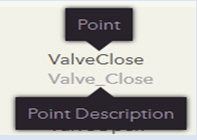
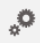

# Chapter 7: Managing the Application

**Manage** section describes the following:

1. [App Configuration](chapter-7-managing-the-application.md#app-configuration)
2. [Manage User Roles](chapter-7-managing-the-application.md#manage-user-roles)
3. [Trend Configuration](chapter-7-managing-the-application.md#trend-configuration)
4. [Trend Database Configuration](chapter-7-managing-the-application.md#trend-database-configuration)
5. [Bulk Import Data](chapter-7-managing-the-application.md#bulk-import-data)
6. [Processes for Alarms](chapter-7-managing-the-application.md#processes-for-alarms)

## App Configuration

App Configuration page has been divided into few sections. Each section has settings related to a specific area in IBMS app.

<mark style="color:blue;">**Path**</mark>\
<mark style="color:blue;">**Settings**</mark> <mark style="color:blue;"></mark><mark style="color:blue;">icon</mark><mark style="color:blue;">🡪</mark> <mark style="color:blue;"></mark><mark style="color:blue;">**Manage**</mark> <mark style="color:blue;"></mark><mark style="color:blue;">section 🡪</mark> <mark style="color:blue;"></mark><mark style="color:blue;">**App Configuration**</mark>

1. Click the **Settings** icon  and select **App Configuration** under **Manage.**
2. After configuring the following settings, click **Update** to save the settings.

### General Settings

<table><thead><tr><th width="227">Field</th><th>Description</th></tr></thead><tbody><tr><td>“<strong>Comment required for write command</strong>” check box</td><td>If this check box is selected, Real Time GUI and Real-Time Values pages of equipment and systems will have mandatory comment boxes for the user to add comments when manual override is done.</td></tr><tr><td><strong>“Enable desktop sound/flash notification for new alarms</strong>” checkbox</td><td>This enables desktop beep sound and flash notification when a new alarm is triggered. Desktop sound/notifications for new alarms work only for https connections.</td></tr><tr><td><strong>System User Account</strong></td><td>Allowed to select the <strong>System User</strong> which will be logged as the user in user transactions.</td></tr><tr><td>“<strong>Display Alarm Class in Weblets and Search pages</strong>” check box </td><td>Used to enable/disable displaying <strong>Alarm Class</strong> in weblets and in search pages where Alarm class is not already displayed as a search filter.</td></tr><tr><td>“<strong>Merge Point Name and Point Description in Real-Time value page</strong>” checkbox</td><td>
If this check box is selected, Point Name &#x26; Point Description will be merged and displayed in one column on Equipment/ System Real-Time Value pages.   E.g.

<em><mark style="color:blue;">Note: A quick method to navigate to</mark><mark style="color:blue;"> </mark><mark style="color:blue;"><strong>Equipment Real-Time value page/ System Real-Time value page</strong></mark><mark style="color:blue;">,</mark></em>

<em><mark style="color:blue;">Go to <strong>Equipment Search page</strong> and filter equipment records. Click the <strong>Real-Time Values</strong></mark></em>   <em><mark style="color:blue;">icon of the respective equipment record.</mark></em> 

<em><mark style="color:blue;">Go to <strong>System Search page</strong> and filter System records. Click the <strong>Real-Time Values</strong></mark></em>  <em><mark style="color:blue;">icon of the respective System record.</mark></em>
</td></tr><tr><td><strong>Enable auto refresh in Real-Time Value page</strong></td><td>
Used to enable Auto Refresh feature on every Equipment Real-Time Value page.

 Once enabled, Auto Refresh icon will be green.
</td></tr><tr><td>“<strong>Enable only "Print Chart" function in Trend Graphs”</strong> checkbox</td><td>

<em><mark style="color:blue;">Note: To navigate to <strong>Historical Trend Graph /Real Time Trend</strong></mark></em> <em><mark style="color:blue;"><strong>Graph,</strong></mark></em>

<em><mark style="color:blue;">Go to <strong>Equipment Search page</strong> and filter equipment records. Click the <strong>Real-Time Values</strong></mark></em>  <em><mark style="color:blue;">icon of the respective equipment record.</mark></em>

<em><mark style="color:blue;">Click</mark><mark style="color:blue;"> </mark><mark style="color:blue;"><strong>Historical Trend</strong></mark><mark style="color:blue;"> </mark><mark style="color:blue;">icon</mark></em> <em><mark style="color:blue;">of the required point to go to</mark><mark style="color:blue;"> </mark><mark style="color:blue;"><strong>Historical Trend</strong></mark><mark style="color:blue;"> </mark><mark style="color:blue;">tab in point details to see this feature.</mark></em>

<em><mark style="color:blue;">Go to <strong>Real Time Trend</strong></mark></em> <em><mark style="color:blue;">tab to observe</mark><mark style="color:blue;"> </mark><mark style="color:blue;"><strong>print chart</strong></mark><mark style="color:blue;"> </mark><mark style="color:blue;">feature.</mark></em>

 

<em>This feature is applicable for both Equipment and Systems.</em>

<em>Also applicable for Trend Groups (<strong>App</strong></em> 🡪 <em><strong>Groups tab</strong></em>🡪<em><strong>relevant Trend Group</strong>).</em>
</td></tr><tr><td><strong>OnDemand polling frequency</strong></td><td></td></tr><tr><td><strong>BACnet OnDemand trend polling request frequency</strong></td><td></td></tr><tr><td><strong>BACnet OnDemand trend polling request time out</strong></td><td></td></tr><tr><td><strong>Maximum month range for trend chart filter</strong></td><td></td></tr></tbody></table>

### Process Trigger Priority Settings

App Admin shall select the required setting for **Process Trigger Priority** under App Configuration page. Default configuration “**Terminate the running process”** will terminate the current process and start another process. (E.g. If a new alarm generated, the current alarm will be stopped and new alarm will be notified). Other option “**Terminate this process**” will terminate the process without starting a new process.

1. On the App Configuration page, select the **Default Configuration** from the list for **Process Trigger Priority**.

### Alarm Viewer Settings

If it is required to show the Alarm Viewer Pop-up;

1. Click the **Settings** icon  and select **App Configuration** under **Manage** Section.
2. On the App Configuration page, go to the **Alarm Viewer** section.\
   Alarm Viewer Pop-up setting allows to configure the following.
   * **Show Pop-up Alarm Viewer**
   * **Show Acked Alarms in Alarm History Viewer**
   * **Alarm confirmation required**
   * **Apply Filters for New Alarms**
   * **Show Only Active and Cleared Alarm Tabs**
   * **Show Alarm Summary Tab in Alarm Viewer**

#### “Show Pop-up Alarm Viewer” Check box

1. Select the **Show Pop-up Alarm Viewer** check box if it is required to show the Alarm Viewer pop-up.
2. Alarm Viewer Pop Up will be displayed, when you click **Alarm** icon  in **App Dashboard**.

#### Show Acked Alarms in Alarm History Viewer Check box

Select the **Show Acked Alarms in Alarm History Viewer** check box, if it is required to show the acknowledged alarms under **Alarm History Viewer**. If this check box is selected, the acknowledged alarms will be cleared and displayed under **Alarm History Viewer**, without displaying under the **Acknowledged Alarms** tab on **Alarm Viewer**. **Alarm Viewer** will have a link named **Alarm History Viewer** to view the alarms in **Alarm History Viewer**.

#### Alarm Confirmation Required Check box

Select the **Alarm** **Confirmation Required** checkbox, if the alarms need confirmation actions (Corrective Action required and Corrective Action not required).\
If the **Alarm** **Confirmation Required** check box in App Configuration page is selected;

* Acknowledged alarms under “Alarm Viewer” will have a **Confirm** button ![](data:image/png;base64,iVBORw0KGgoAAAANSUhEUgAAAE8AAAAkCAIAAABHZfBIAAAAAXNSR0IArs4c6QAAAAlwSFlzAAAOxAAADsIBw3GpnQAAApVJREFUaEPtVs9L21Acf+5PSIvJWnrr8DRcvUTotWNgxMtuYxP1IOzgpQhuvZReugkll948RFHxD5BFEHut2kvL6CngLbQmXfVv2DcvaRqHaV9C8wbxhR7KS97n+/38eD/m/gzuEX6qe2f2n/g9pf1PNqlX8eM2gRFjG1+7mbfM23gowJIcDx+fY8G8Zd5GpEDq44asFGVlbSmiAk9h5wamc0/+8Y3ongz97UrcGMRo1UrNfrhel9fk7Wz3QD68hfkLm4r0Ft2dbp23w6H5z/r+M8w9GRoqAlXor7iFf+WWKYi7Owvh2kulQbVHs+edzQmZcGBEs8h3qeRKFbRHIyswut7cB851jajUlI+0Q0vBowt9FmA+GMRJzuT3KiI/MbdPQt5RRyrgiHbuurksiAVmNspACbRbLwijpqyPH6wRZK8L7xTItraoSPNqayCJGAFGrgVnuo02RaDgSU4neMC8H/ot0aUdCDlqlEcJz0lyNZ9y28hxpvXquGFwha8wPrwoyTX1EZP3SYczxVnGvJT4ba8dlP2srPPnXjTSOJAneSJiJv8+h0z1lyOz3jwBJoL4Ydl17wa/GhqwJwoJ19RJoB17iougWbuXrnUNhIzWpbWx2Whv3hEvdWK2vQcT8F8nx3Z5O8XOD3pDd6zfA98if4x+sCrEbPXmVcdfSKzFfDrp8ntuv42c/NQCxGwRatfVLuIKlY0VNzlwYCrFTYgr1oKXVp1XmfwXOJP/ieLUXqL/IABbhKxDoqaiQgVuP/i3nYUlZKat3ahd97yqiEg9ntHJNEsNiE+gWRaljRX8BKLdYST1AiU5kg5ogjK2NNWmW4t5S1dvmtWYtzTVpluLeUtXb5rVXpa343syTY3/V62X5e1f6FsFXuHyh3wAAAAASUVORK5CYII=) to confirm the Alarms by the user.
* **Confirmed Alarms** tab on **Alarm Viewer** will be displayed containing the confirmed alarms.
* **Alarm History Viewer** link on Alarm Viewer will be displayed.

#### Apply Filters for New Alarms

This option allows to apply filters for alarms with “New” status in Alarm viewer according to the customer requirement.

* To apply filters for alarms with the status “New”, select the “**Apply Filters for New Alarms**” check box
* If you do not need to apply filters for New alarms, deselect the check box.
* Once you enable this feature,&#x20;
  * **Filter** icon  will be enabled on Alarm Viewer page (To go to Alarm Viewer Page, go to **Settings🡪View🡪Alarm Viewer**).
  * Or go to **app dashboard** and click **Alarm** icon.

#### Show Only Active and Cleared Alarm Tabs

The alarm viewer will only have two tabs available when this option is enabled. Below tabs will be enabled when “**Show Only Active and Cleared Alarm Tabs**” check box is selected under **App Configuration.**

1. **Active Alarms tab**
2. **Cleared Alarms tab**

#### Show Alarm Summary Tab in Alarm Viewer

When **Show Alarm Summary Tab in Alarm Viewe**r check box is selected,  the **Alarm Summary** Tab will be displayed on the **Alarm Viewer** page (Settings🡪View🡪Alarm Viewer).

If it is deselected, the Alarm Summary Tab will not be displayed on the Alarm Viewer page.

### Operating Scope Settings

The following operating scopes cannot be changed by the end-users.

<table><thead><tr><th width="280">Field</th><th>Description</th></tr></thead><tbody><tr><td><strong>Equipment Based Permission</strong></td><td>Used to filter equipment to Equipment search page based on the Asset Group. If Equipment based permission is selected, both location scope and Asset group scope will be applied.</td></tr><tr><td><strong>Location Scope</strong></td><td>Location scope is applied to search pages where location, Equipment, Zone interfaces etc. are used.</td></tr><tr><td><strong>Point Based Scope</strong></td><td>Applied to filter point related pages, equipment point configuration and Real Time pages</td></tr></tbody></table>

### Alarm Escalation Settings

This section allows admin to configure the following;

* **Alarm escalation disable notification group**: Group to be notified when alarm escalation is disabled
* **Alarm escalation disable message template**: Message template used in Alarm escalation disable notifying message
* **Assignee message template**: Message template used in messages to be sent to Alarm assignees
* **Unassignee message template**: Message template used in messages to be sent to respective users when alarms are unassigned

Once you are done with necessary configurations, click **Update** to save the changes.

## Manage User Roles

This section describes how to add and manage **User Roles** and their User Rights. A **User Role** grants permission for app users to perform a collection of tasks, through the User Rights attached to it. User Rights in a User Role, give access rights to functionalities in IBMS App.\
\
User Rights are grouped into four ‘User Rights Groups’ (Guest User, Normal User, Power User and Administrator) based on the typical access permission levels. (E.g. **Administrator User Rights** – group the User Rights typically associated with Admins to perform crucial tasks such as Master data configurations, **Guest User Rights** –group the User Rights which allow tasks such as view search pages/reports in app).

<mark style="color:blue;">**Path**</mark>\
<mark style="color:blue;">**Settings**</mark> <mark style="color:blue;"></mark><mark style="color:blue;">icon</mark><mark style="color:blue;">on the</mark> <mark style="color:blue;"></mark><mark style="color:blue;">**Application Home page**</mark> <mark style="color:blue;"></mark><mark style="color:blue;">🡪</mark> <mark style="color:blue;"></mark><mark style="color:blue;">**Manage**</mark> <mark style="color:blue;"></mark><mark style="color:blue;">section 🡪</mark> <mark style="color:blue;"></mark><mark style="color:blue;">**User Roles**</mark>

### Add a new User Role

1. Click the **Settings** iconand go to **Manage** section 🡪 **User Roles**.
2. Click the **Add** icon  . Add User Role window will appear.
3. In the **User Role** box, type the name of the User Role. (E.g. FM Manager)
4.  User Right Configuration

    1. To view User Rights available under a typical User Role Group, expand by clicking the respective  icon.
    2. To add all the User Rights grouped under a typical User Role to the new User Role at once, select its checkbox.
    3. If not, select each checkbox, to add them individually to the User Role as you require.

    _**E.g**. User Role - e.g. Administrator_&#x20;

    _User Rights – Administrator User Rights (If the “Administrator User Rights” checkbox is selected, all the User rights under “Administrator User Rights” will be applied. Or else, select individual User Rights considering the permissions you need to provide to each functionality in the App)_
5. Click **Add**.

### Edit an Existing User Role

1. On the User Roles page, find the User Role that you want to edit and click the respective **Edit** icon![](data:image/png;base64,iVBORw0KGgoAAAANSUhEUgAAAB4AAAAdCAIAAAAyxktbAAAAAXNSR0IArs4c6QAAAAlwSFlzAAAOwgAADsUBWmncRwAAAq5JREFUSEud1t1v0lAUAHD6AWRQPtrqINEwZQITHmRZjInxI8a4mPgH6J/ou8YYYjQxc4tMxZiYaBaN8cVAgJW1hVFK67mUteW2t3Q0PNDLOb8ezr3tLWWaZiT08ffXvhVb2Ly9NIki0aAYhqEOR4o81LQJfNcnOhtlaZqOxaJcKlG78ShYJ9KfD15KAyViGsR8is5mOEHMXC3f9Y3xp981nhtTMuqSKJrO5YRUivO2CKdbzVf9nrS0j1iAIGTECzymOzQ0t9eTVnCtywhiVhSzbp22ry8r6souIJAry4q9hGBkTv/++b7T7p2jD5RTk53V6fR1XbdP5xHSsRxy3i4VSg92nz58/OxapY6VAgI4C/Sfo71jyRkKqL1QvL5Vu0kzDMRsFKsZ/iIWDA5o1iCqWlWHQev3LBvcUmXbbcVicbwO01CUoUMrymhplwvFKuaORmqv2/YmqupcQ1WPx1owPXMXOquNR18O3xrTiTfR1hCt69PA/vq4hx/fnKr+02NriDYN4j19eaPsrTfAdWuIhucAqepu9x/8d/tX+B7sosizJY9QlkWLyXuUqzvaKbIsPZQbiUSjjHVPIjoej/nSgpCv79y39IHUXV7vTAHNepIgOplcIzWEF3OW/umgQZo3LNfWEM1xCbtB7rhvrb3mh9dHP1o0Q5wMvCaKRtrsQDmwJ8F+4S18qA7kkz58dG3JwrdzwblSuuPQ0BpeSJ+jNEL7QADH/nH+T4uVe+vrAqnjIcdBAAen4Rz2N9iHQireMMit1Xfd4878QFtgf+P5VXTI2r71BLuez47+/Wuj3e4H3P0LBEXn8wJWrxVAfA9p7r+QT9TA9xAqleZEIbO55fTXfVUiDUGwX9hvT1M49CnDMnDEoiyXTiYTa7BqA97QgmirBOuBEOYlD+v1f7C3QmEU+RLIAAAAAElFTkSuQmCC).
2. To find a specific User Role(s) based on its text, type in the required text in the Search box.
3. Select the required search criterion in the drop-down box to filter the User Rights.
4. Make the required changes and click **Update**.

<table data-header-hidden><thead><tr><th width="283"></th><th></th></tr></thead><tbody><tr><td><strong>Search filter in List box</strong></td><td><strong>Purpose of Search filter</strong></td></tr><tr><td><em>All Items</em></td><td>To view all the User Rights</td></tr><tr><td><em>Selected Items</em></td><td>To view only the selected (ticked) User Rights</td></tr><tr><td><em>Unselected Items</em></td><td>To view only the User Rights that are not selected</td></tr></tbody></table>

### Delete An Existing User Role

1. On the User Roles page, find the User Role that you want to delete and click the respective **Delete** icon  to the right. A message to confirm the deletion will appear.
2. Click **OK** to confirm. Click **Cancel** to abort the operation.

### Copy an Existing User Role to Another User Role 

\
Copy feature allows you to copy an existing User Role including its all User Rights to another User Role at once. You can

1. Copy an existing User Role to a new User Role
2. Copy an existing User Role to another existing User Role

#### **Copy an Existing User Role to a New User Role**

1. Go to **Settings🡪Manage🡪User Roles.**
2. Click the **Add** icon.
3. Type the new User Role that you need to create in the ‘**User Role’** box.
4. Select the User Role that you need to copy, from the ‘**Copy**’ drop-down box.
5. Click **Add**. Selected User Role’s User Rights will be copied and applied to the new User Role.

#### **Copy an existing User Role to Another Existing User Role**

1. Go to **Settings🡪Manage🡪User Roles.**
2. Select the User Role that you need to edit and click on its **Edit** icon![](data:image/png;base64,iVBORw0KGgoAAAANSUhEUgAAAB4AAAAdCAIAAAAyxktbAAAAAXNSR0IArs4c6QAAAAlwSFlzAAAOwgAADsUBWmncRwAAAq5JREFUSEud1t1v0lAUAHD6AWRQPtrqINEwZQITHmRZjInxI8a4mPgH6J/ou8YYYjQxc4tMxZiYaBaN8cVAgJW1hVFK67mUteW2t3Q0PNDLOb8ezr3tLWWaZiT08ffXvhVb2Ly9NIki0aAYhqEOR4o81LQJfNcnOhtlaZqOxaJcKlG78ShYJ9KfD15KAyViGsR8is5mOEHMXC3f9Y3xp981nhtTMuqSKJrO5YRUivO2CKdbzVf9nrS0j1iAIGTECzymOzQ0t9eTVnCtywhiVhSzbp22ry8r6souIJAry4q9hGBkTv/++b7T7p2jD5RTk53V6fR1XbdP5xHSsRxy3i4VSg92nz58/OxapY6VAgI4C/Sfo71jyRkKqL1QvL5Vu0kzDMRsFKsZ/iIWDA5o1iCqWlWHQev3LBvcUmXbbcVicbwO01CUoUMrymhplwvFKuaORmqv2/YmqupcQ1WPx1owPXMXOquNR18O3xrTiTfR1hCt69PA/vq4hx/fnKr+02NriDYN4j19eaPsrTfAdWuIhucAqepu9x/8d/tX+B7sosizJY9QlkWLyXuUqzvaKbIsPZQbiUSjjHVPIjoej/nSgpCv79y39IHUXV7vTAHNepIgOplcIzWEF3OW/umgQZo3LNfWEM1xCbtB7rhvrb3mh9dHP1o0Q5wMvCaKRtrsQDmwJ8F+4S18qA7kkz58dG3JwrdzwblSuuPQ0BpeSJ+jNEL7QADH/nH+T4uVe+vrAqnjIcdBAAen4Rz2N9iHQireMMit1Xfd4878QFtgf+P5VXTI2r71BLuez47+/Wuj3e4H3P0LBEXn8wJWrxVAfA9p7r+QT9TA9xAqleZEIbO55fTXfVUiDUGwX9hvT1M49CnDMnDEoiyXTiYTa7BqA97QgmirBOuBEOYlD+v1f7C3QmEU+RLIAAAAAElFTkSuQmCC). ‘Edit User Role’ page will appear with the selected User Role’s name under the ‘User Role’ box.
3. Select the User Role which you need to copy from the drop-down box named ‘**Copy’.**\
   Message will appear to confirm the action.
4. Click **OK**. User Role selected under ‘**Copy**’ box will be applied to the selected User Role

## Trend Configuration

Trend Configuration functionality in the system is used to add/edit/delete and audit Trend Data.\
\
Trend Data Functionality will be useful in situations such as;

* When SSIF goes offline/ subsystem communication fails, all trend data generated during that period may be lost.
* When a device sends false data due to malfunctioning.

Trend Configuration page can be used to correct or remove corrupted data where necessary. If any Trend Data loss occurs for a significant period of time, you will need to add trend data to iviva system manually via Bulk Data upload. Trend data added to the system via Bulk data upload will be displayed under Trend Configuration page.

Trend Configuration page allows you to audit the uploaded trend data by comparing data editing and verifying, before confirming them for trending.

**Trend Configuration functionality**

1. First, upload the Trend data via **Bulk Import Data process**.
   * Go to **Settings 🡪 Manage 🡪 Bulk Data Import.**
   * To import bulk Trend data to system, go to the **Trend Data** tab on the Bulk Data Imports detail page and follow the Bulk Data Import process.
2. To view the uploaded Trend data;
   * Click the **Trend Configuration** link on the side bar on the Trend Data tab under Bulk Data Import detail page OR
   * Go to **Settings 🡪Manage 🡪 Trend Configuration.**
3. On the Trend Configuration page;
   * Click **Add** icon and add new individual trends.
   * Modify the Trend data as required.
   * Click “Show only modified” check box to display only the modified Trend data.
   * Click “Show only bulk uploaded” check box to filter and display the trend data added only through bulk data import process.
   * After comparing and verifying Trend values, click Confirm to save the Trend data for trending.
   * If it is required to discard all the changes done in Trend data, click ![](data:image/png;base64,iVBORw0KGgoAAAANSUhEUgAAABUAAAATCAIAAADwLNHcAAAAAXNSR0IArs4c6QAAArxJREFUOE9tk9lPE1EUxjt7oSAqS5lhaEWwyhKJhqgJifpg/Ht9IjEhmIDGkBjUKrXGFkoXhtaWTjecztL63Tk4tso8nbn3/M757lm4ZvMsdNXX7/e7tut5Hi5FQZAkkee5/x25f3hgYPKl6lGu7Hg9nuNcz+V5XpEldfbmYmxaluXBKEM8SKNsZk/OzEYHTsAovyAIvV4PxvjYyO1YVNcmRVGgKHwQDK6VWvNz6qRutgkmBjBEwcZJu2N9OjwunNZwMsTj36iYB8ljx3E4jiMYh5QZnyiKFAUnX9P5bM4Y4uGbxYP/wBwXWl9NLMR1gkkCBJLhum6uUPU8pu5Sf6FYNRttyizw/PPNR2vLiRsT47KExCwz4EHD6jpfvuXAs/rhemcv2b7oAo6MhDcerGmzMwDwSZLUbLVLRqVolKu1OmkBhqtwWHn5bJ3ld13Pdll5cK2pM2p0mmC0CqHDirxyd/HF0yexuVlIgD+e6Tv3ra7NeMf1oBwAvDPHhd33H2zHAdxotWrndYqCN28+fqhrURgQBX/HsW3bZbxf2Ms+s+EpGu/2P7ZanUz2ZHt3/9XWTup7Bi/FF9fVQL8giKxe4FEjLsRTbfFBZKV6/vrN28JpGb/tTieZ+nGQTFmWNT4W8TMz/SizJAqMxzCNjsqDrYKNR138sqjz8KnVTUVR8qUzagSi9EM9RZEYj8XQ1clg1Ab7HKi9Na+ZjWYqnUFmwIirq1MCNNAYxeamJq5FaMKCPqNO/mX//mqi3mhtbe9hzACjhCNheSUx/3d+sJ6L8ejgqJFsuGLSD9PZXL7ECui3CVdLC6oo+tqD/VGj1zfWl6COPKjP9FQqGGWG5ntLc3F9msCh/YX+fPHnUb6CPaMq0KgRDGMsEr6zoGF/EeUKno6wGOlMoWSYMDBIiOJvoRfTppYTerD55PwbDWH22ev+Pk4AAAAASUVORK5CYII=) icon.
   * If it is required to delete all the Trend data displayed on the Trend Configuration page, click ![](data:image/png;base64,iVBORw0KGgoAAAANSUhEUgAAABQAAAATCAIAAAAf7rriAAAAAXNSR0IArs4c6QAAA1NJREFUOE+dk0toXGUUx7/XvXPvjEnmlcQkmFIsMbHGWFOCVlGxKjYwpQ+spVI3LirdSOxOBF2IUMSlggouRMSFT0TFahfSagkOoXZIkzS06dTpZNqZTDKPO3fu/R7H73YyJY07D2dxP77/7zzuOR+uVgvo/xreBONqnc4u0GyeFIrEcbBEyjJVT1IO9ouHt0O0c2OiDbBUJHvd/OlXI3MJud6maoBRsXWLSD0tHhxBhLRu2zAAXVwyv/yezl3BAAhpx5t5jORAn39wj5oYA0r1bTtGqcxOnSELVzDnmuRbB5H+EKLlQAlSCnNBsznjh9NkcakV9xYsJcssmH+kSb0BpllLPb965AVvZAhxgXwuujorB/c6zz6ps2HfZ5eX6MwscpvrMK7V6W9noFIFn3uP7GzsfkpsGay8uM+7/z4Rj1UP7XMef3R172Rt8hmlu6k5JP03WS6uw1Cu4Gxe+Vxxwc6lrVzeMAy0bVv1+CtrU6+64w8pgxHOzdkFqDe0DGXm8Y02jMoV6Tjc59pFLh96/8PwzAWbGeZAPx4ZppYV+ifX+d4H6M80F0JrpMdhtYr0dIKeuZBNX/oicC7l5Sz56DPbdcPhsG3bJqWhs9M4fUEKua7RMs8DaMEdEYmw4rpsrnTU/j52+ACNxxhjpjbbholxOTosXa+lkVKgjjCmLIAh3iWjUdHk2iERD00dM/ZPYsuC/DLMzjEAPPYAf+2YmNgh3EAju5MomdB7EMA41oUe28k9KV2uImGih2wYcv6S88ZJ58Q78Ps5RggZuhcOpWQkLCXA2CgauLs9Z9vCu3ehkSHRFM2Z+bUTb8nc9dqbJ53vfmlOn69Pva3OTjPPUx9/LpbLuka8a0eQ7/Z6guerb0+7736irhUIKBS3UbnR3j8gw/fgDkv8tUijnfRoynz9ZRzfACulRHmt+cWP6tOv4WqeKPWfxcYQj7KXUvbxw7SvG+Ng89cfBgA0Gq5Tq9W/OcW/+pldzYWcJhMKAUhGglb7E/i5J+yj+yM9yUgkfAeswwghVlbKxcLNYuaik5mDawXD84K3Y9t4oNfaPhQbH00ktSX0CO98krdOuvhSaaVQuFEqlpy1quS+Ls4Mhe6KRmPdid7enkQirn/87Y7+BZ5K4d21eqxjAAAAAElFTkSuQmCC) icon.


_Note –_ _Please refer to_ _**Bulk Import**_ _**Data**_ _User Guide to find the details on importing application related bulk data to databases._


## Trend Database Configuration

## Bulk Import Data


_Note –_ _Please refer to_ _**Bulk Import**_ _**Data**_ _User Guide to find the details on importing application related bulk data to databases._


<mark style="color:blue;">**Path**</mark>\
<mark style="color:blue;">**Settings**</mark> <mark style="color:blue;"></mark><mark style="color:blue;">icon</mark> <mark style="color:blue;">🡪</mark> <mark style="color:blue;"></mark><mark style="color:blue;">**Manage**</mark> <mark style="color:blue;"></mark><mark style="color:blue;">section 🡪</mark> <mark style="color:blue;"></mark><mark style="color:blue;">**Bulk Data Imports**</mark>

### Point Bulk Upload with Override Options

Point Bulk Upload has been enhanced to upload Point properties which are inherited from Point Template and to use those Point properties to override values of Point.

**Download Point Data with Override Options**

This is used to download Point specific Data with Properties inherited from Point Template and alarm details (which will be used to override Point values) and to export them to Excel.

1. Go to **Settings 🡪Manage 🡪 Bulk Data Imports 🡪 Point Data** tab.
2. On the **Point Data** tab, click the Download Points Data link on the Side bar. Points search page will open.
3. Select the **Download with override options** checkbox.
4. Click **Export to Excel** link. Data along with properties inherited from Point Template will be exported to an Excel file.

**Upload Point Data with Point Override details**

Upload the Excel file with Point data and properties inherited from Point Template.

_<mark style="color:blue;">**Note**</mark><mark style="color:blue;">: For details on Bulk Data upload, please refer to the Bulk Data Import user guide.</mark>_

## Processes for Alarms

**Processes for Alarms** allows you to configure **Process Types** and **Stages** for alarms. **Process Types** that are tied with alarms will be retrieved and displayed under “Processes for Alarms” page. You need to upload the relevant Process for alarms to **Process Type**.\
An alarm **Process Type** allows you to define a process for Alarm status transitions.

**The Alarm state transition is called Normal to Alarm (N2A)**

Alarm state transition happens based on the point value of the alarm point. Changes happen due to the point value being changed based on a field sensor condition.

* Alarm **Stages** are a condition of an alarm based on the actions taken on an alarm.
* A newly created alarm would be in a **default** **Stage** provided that there is no Process Type associated with the **Alarm state transition.** Which means no user interaction has happened.
* Alarm **Stages** are user definable depending on the requirement.
* An Alarm **Process** is a combination of activities and Alarm **Stage** transitions due to those actions. For example, when an alarm happens, a process maybe defined for an incident to be created, a work order to be created and a notification to be sent, changing the alarm stage to be notified.

<mark style="color:blue;">**Path**</mark>\
<mark style="color:blue;">**Settings**</mark> <mark style="color:blue;"></mark><mark style="color:blue;">icon</mark> <mark style="color:blue;">🡪</mark> <mark style="color:blue;"></mark><mark style="color:blue;">**Manage**</mark> <mark style="color:blue;"></mark><mark style="color:blue;">section 🡪</mark> <mark style="color:blue;"></mark><mark style="color:blue;">**Processes for Alarms**</mark>

### Upload Process to the Process Type

1. Click the **Settings** icon  and select **Processes for Alarms** under **Manage** section. **Processes** page will appear.
2. On the **Process Types** tab, the created **Process Type** will be listed.
3. Upload the required **Process** via the **Process Editor** to the **Process Type**. Once a **Process** is uploaded, its name will be displayed under the respective **Process** **Type**.

#### Delete Process From Process Type

1. Go to **Settings 🡪Manage 🡪 Processes for Alarms**
2. On the Process Types tab, click the  **Delete** icon which is displayed along with the **Process** that you want to remove from the **Process Type**.

#### Preview/Download the Uploaded Process

To view the uploaded Process diagram of the Process Type;

1. Go to **Settings🡪Manage🡪Processes for Alarms**
2. On the Process Types tab, click the **Preview** link which is displayed along with the **Process** that you want to view. Process diagram will be displayed.

To download the Process;

1. Click the **Download** link which is displayed along with the **Process** that you want to download.

### Add Process Stages

After uploading a **Process** to the **Process Type**, you need to add the **Stages** of the **Process**. It is required to add the same **Stages** that you find in the uploaded **Process.**

1. Go to **Settings🡪Manage🡪Processes for Alarms.** Process Configuration page will appear.
2. Click the **Stages** tab.
3. Hover over the stage value for the Default Stage field, and click on the **Edit** icon ![](data:image/png;base64,iVBORw0KGgoAAAANSUhEUgAAAB8AAAAnCAMAAAG3XlNdAAAAAXNSR0IArs4c6QAAAARnQU1BAACxjwv8YQUAAAH4UExURfLy6PPz6fT06vT06fX16/b27PHx5+np4Ojo3+/v5fb37Pf37d7e1MPDurW1rbW0rMLCudra0e7u5PPz6tvb0qalnnRzbGloYmppYnZ1bpuak87Oxe/v5qSknGtqZExLRUlIQkpJQ01MRmRiXJ+el97e1dvb0aamnmpqY09OSFNSTFVUTlFQSnx7dcrKwfDw5t3d06WlnWtqZVJRS1BPSVZVT1dWUFhXUXV0bfX269va0W1sZU9OSVRTTYKBetDPxtzd06inn2RjXaGgmeTk2/r68PT0693d1GxrZVRUTYyMhfj47tra0qenn09NSICAeMLCuvb262xsZIGAecbGvezs4uXl26urooGBesPCufn57+rp4L+/tnd2b35+d9rZ0J2clWVkXk5NR1FQS39/eMTEvO3t4+jn3X5+dlxbVYB/eMDAuOjo3uPj2ebm3Li4r39+d15dV1BPSn18dcPCuufn3c/Oxbq6ss/Pxurq4Le2rVtaVE1LRuvr4cbFvI6Oh5SUjNLSyfn57re3rmZlX7y8tMLBuV1dVpWVjfLy57OzqsfHvnBvaEJBO19eWJWWjtHRyN3c0/X17JiXj3Jxand2cJKRiujo3fr67+Hh19DQxsXFvMXEvMjGv9TTyeXl2vHx5u7v5Ovq4enp3+zs4fDw5fP06gAAAL/4+fkAAACodFJOU///////////////////////////////////////////////////////////////////////////////////////////////////////////////////////////////////////////////////////////////////////////////////////////////////////////////////////////////AJlf7PQAAAAJcEhZcwAAFxEAABcRAcom8z8AAAIJSURBVChTdZMxj9swDIU9J+gkwAKyxIARb9bCQdsBQrdbMvYnFOhQr96KDkaXdvKiqRN/aN8j5fTugCiKTPGjHilZ7moItQscqpa5C59EO51VuwACoBwyhrwB0KdBrSMCDS5GlZxXGF81b2AdMJcyBtJU9zXKNJXEEJbTABChoFbJUlnPkMUKW5YrYrB8X04mSA1X5vimW8633XJbs2psCf3QLePv5NtjSC3IJt8sHx1FJGdJCD5DVMPyC1VtleWbo991AYWsVeatTXEaxxw2/xCl8b9jCx/qfIc/7qxtDMkBadrcCNR97g309IjHb+rj3uIhG6YoMmDbjCeNbZfG6xRxCMMrbONOZ2Yh1x5nInfTYX16lzwYPZOvq84+5TyElFe9MAlLxv7/9j+0sjasx5wCoCfWz5vmzaLhwJxHR2TN4p/3wCusvEhPRuNPaeO4leZ7GB4CzkvhwIeH4TPPz0Daj6fRd/zw0Ji25UuaWqzv35HdoOkSB7TxcqMA8x8YJ6PT5yhDxssZ+gSf108dk58K3jIoLvRY7EtR51gP5RIHvldQeUl6toWNh3or8cq1eLWkcFtJjddpH6/2ZYjck90EVufrkfimuswjIKk38PPBt9d9rYiIL9upKRs99Lf4J+8/w3ecCma+W3CU6Py2ppRWv+E8Ngvhw/nRiNjt4SrODfjoZnuE8A9woHINsh2okQAAAABJRU5ErkJggg==) that appears.
4. Click in the **Default Stage** box and select a new default stage from the list box.
5. Click **Save**.
6. Click the **Add** icon . New Stage configuration page pops up.
7. In the **Stage** text box, type the name of the Stage, as in the Process diagram that you upload.
8. Select the **Active** checkbox, if the respective **Stage** is active in the respective Process.
9. Click **Add**.
10. Repeat the steps 6-9 to add all the Stages as in the Process diagram.
11. To delete a Stage, click the respective **Delete** icon.
12. Use the **Up** and **Down** arrows to arrange the Stage order as in the Process diagram.
13. Click the **Edit** icon and add the required UI features of the respective **Stage** and click **Update**.
